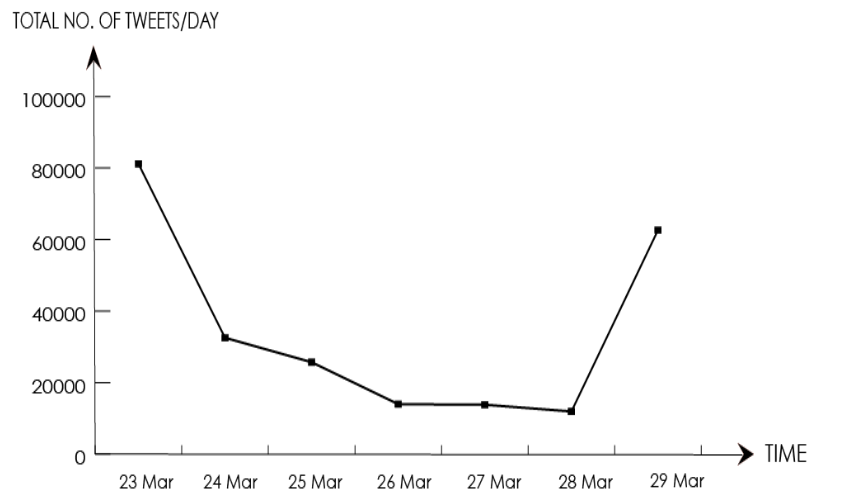
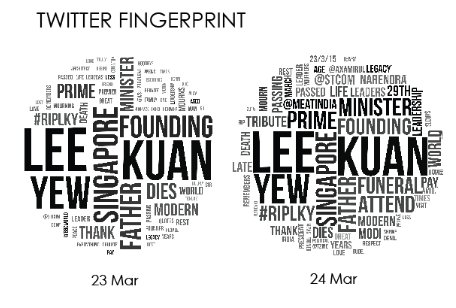
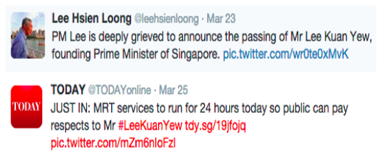
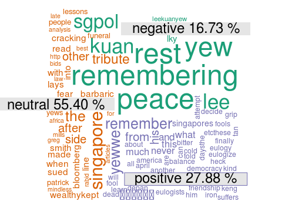

# Remembering Lee-Kuan Yew using Twitter Analytics
Custom Twitter scrapper, clearning and anlaytics in python and [R] used to create an infographic outlining the frequency, content and hashtags of tweets related ot the passing away of Lee Kuan Yew, the founding father of Singapore

This completed as part of the final project of NM3229: Data Visualization at the National University of Singapore in a team of 3. I was teamed up with 2 designers, so my role was to write the code required to create the final visualization (created in adobe illustrator).    

##Approach:

###1) Scraping Twitter

The [Twitter API] (https://dev.twitter.com/rest/public)  creates a way for developers to create applications on the twitter platform.  I used the Twitter [Search REST API] (https://dev.twitter.com/rest/public/search) and save the rearch result in JSON.  Of note Twitter's [stream filter API] (https://dev.twitter.com/streaming/reference/post/statuses/filter) gives real-time results from point of query while the search REST API goes back it time (limited to up to 7 days )     

Limitations according to [API Rate Limit](https://dev.twitter.com/oauth/overview/application-owner-access-tokens) and [API end point reference](https://dev.twitter.com/rest/reference/get/search/tweets):    

- 180 requests per 15 minutes    
- 100 tweets per request    
- search only goes back up to 7 days    
- Search is not exhaustive source of tweets    
- Search API is focused on relevance and not completeness (some Tweets and users may be missing from search results)      

Therefore we can only scrape a maximum of 18000 tweet/15 minutes for up to 7 day old tweets which not include all the tweets.    

Steps:    
    a) Get [Access token auth](https://dev.twitter.com/oauth/overview/application-owner-access-tokens)    

    b) Use [python script] (tweet_scraper.py) to extract tweets in form of json    
Note: This was written in python 2 and requires jsonpickle and tweepy    

### 2) Clean data and visualize

    a) Export the JSON to CSV

Since the visualization was to be created manually by the two designers in my group, I exported the scraped JSON to CSV and wrote scripts to extract revelant information.    

    b) Determine the frequency of words using an [R script](find_word_frequency.R) to use in the word cloud

    c) Determine the number of retweets using an [R script](number_retweets.R)

    d) Sentiment analysis using NLP (see below)

##Results

### Design Elements

Number of tweets per day:     

Twitter "footprint" Wordcloud     

Events by Photos    

Most retweets

### Final results

[Final Visualization (PNG, 8.6 MiB)] (http://mrandrewandrade.github.io/inc/rememberingLKY.png)      
[Design Document (PDF, 1.4 MiB)] (http://mrandrewandrade.github.io/inc/rememberingLKY.pdf)

##Natural Language Processing

While brainstorming for the project, we came up with the idea for using NLP to get the sentiment of the tweets.  I used [datumbox's API]( http://www.datumbox.com/) (and wrote my own using naive bays/bag of words) to classify the tweets and create the following visualization:

     

Since sentiment is very difficult to extract from tweets and contriversial we decided not to include it in the final visualziation.
